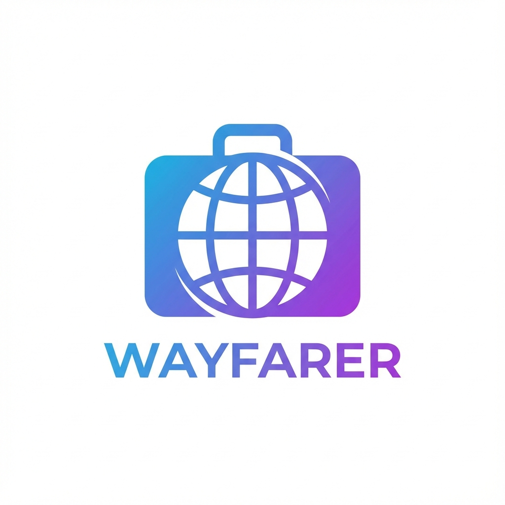
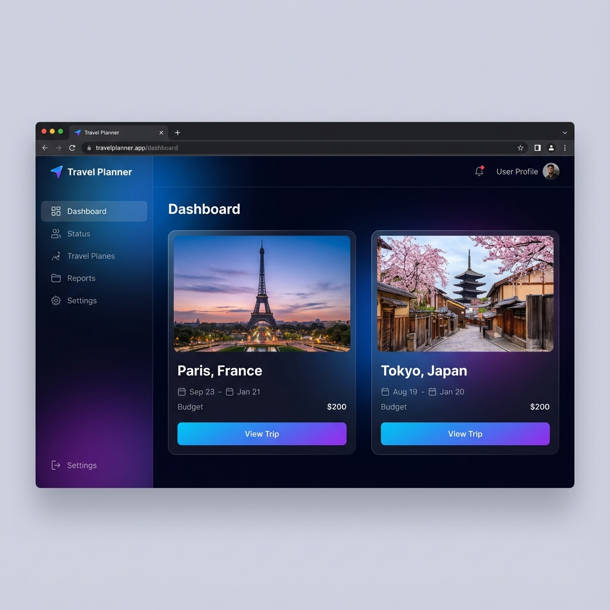

# Travel Planner

<div align="center">
  
</div>


**Travel Planner** is a comprehensive full-stack application designed to simplify the complexity of long-term travel planning. Organize your trips day-by-day, manage budgets, and export your itineraries for offline use—all in a beautifully designed, modern interface.

## ✨ Key Features

- **Intuitive Trip Management**: Create and manage multiple trips with rich details (dates, destinations, cover images).
- **Smart Timeline**: Automatically generates a day-by-day structure based on your travel dates.
- **Granular Planning**: Add specific activities, meals, lodging, and travel details with time and cost tracking.
- **Premium UI/UX**: Built with a custom design system featuring glassmorphism, smooth transitions, and a responsive layout.
- **Export Functionality**:
  - 📄 **PDF**: Download printable itineraries.
  - 📊 **Excel**: Export data for spreadsheet analysis.
- **Full Persistence**: Data is securely stored using a local SQLite database.

## 📸 Demo



## 🚀 Getting Started

See [QUICKSTART.md](./QUICKSTART.md) for detailed installation and setup instructions.

```bash
# Quick Setup (Local)
git clone <repo-url>
npm install
npx prisma db push
npm run dev

# Quick Setup (Docker)
docker-compose up -d --build
docker-compose exec app npx prisma@6 db push
```

## 📖 Documentation

For a deep dive into the architecture, database schema, and code structure, please refer to [DOCUMENTATION.md](./DOCUMENTATION.md).

## 🛠️ Tech Stack

- **Frontend**: Next.js (App Router), React, CSS Modules
- **Backend**: Next.js API Routes
- **Database**: SQLite, Prisma ORM
- **Utilities**: jsPDF, SheetJS (xlsx)

## License

This project is licensed under the MIT License.
