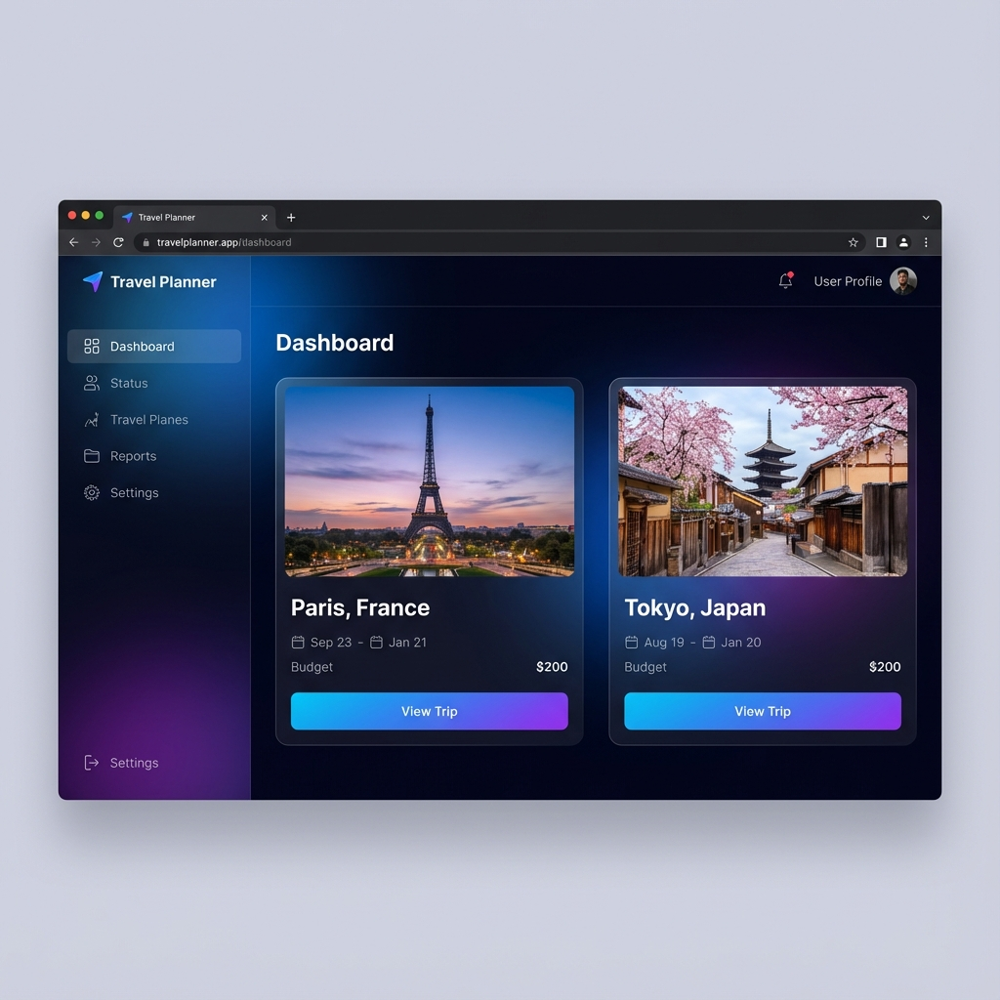

# Travel Planner

<div align="center">
  
</div>


**Travel Planner** is a comprehensive full-stack application designed to simplify the complexity of long-term travel planning. Organize your trips day-by-day, manage budgets, and export your itineraries for offline use—all in a beautifully designed, modern interface.

## ✨ Key Features

- **Intuitive Trip Management**: Create and manage multiple trips with rich details (dates, destinations, cover images).
- **Smart Timeline**: Automatically generates a day-by-day structure based on your travel dates.
- **Granular Planning**: Add specific activities, meals, lodging, and travel details with time and cost tracking.
- **Premium UI/UX**: Built with a custom design system featuring glassmorphism, smooth transitions, and a responsive layout.
- **Export Functionality**:
  - 📄 **PDF**: Download printable itineraries.
  - 📊 **Excel**: Export data for spreadsheet analysis.
- **Full Persistence**: Data is stored in your browser (IndexedDB). Export JSON to back up.

## 📸 Demo



## 🚀 Getting Started

See [QUICKSTART.md](./QUICKSTART.md) for detailed installation and setup instructions.

**Live demo**: [https://persi-man.github.io/Travel-Planner/](https://persi-man.github.io/Travel-Planner/)

```bash
# Local development
git clone https://github.com/persi-man/Travel-Planner
npm install
npm run dev

# Build for GitHub Pages
npm run build:pages
```

## 📖 Documentation

For a deep dive into the architecture, database schema, and code structure, please refer to [DOCUMENTATION](./DOCUMENTATION.md).

## 🛠️ Tech Stack

- **Frontend**: Next.js (App Router), React, CSS Modules
- **Storage**: IndexedDB (browser-local)
- **Deployment**: GitHub Pages (static export)
- **Utilities**: jsPDF, SheetJS (xlsx)

## License

This project is licensed under the [MIT License](./LICENSE.md).
