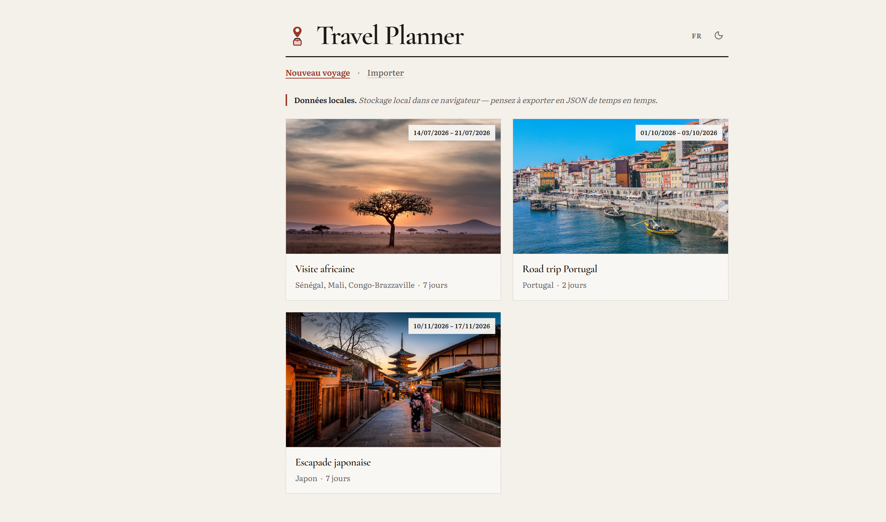
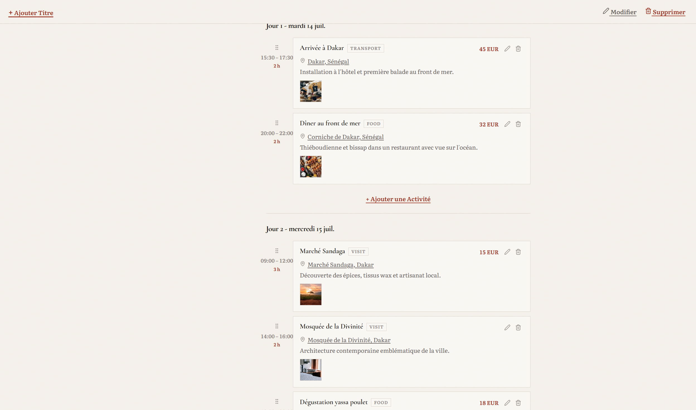

# Travel Planner

<div align="center">
  
</div>

<br />


**Travel Planner** is a static web app for planning multi-day trips. Build day-by-day itineraries, track a budget, attach photos, and export everything — with no account and no server. Data stays in your browser via **IndexedDB**.

**Live app:** [https://persi-man.github.io/Travel-Planner/](https://persi-man.github.io/Travel-Planner/)

## Screenshots

Captured from the app running locally (`npm run dev`) with demo data.

### Dashboard — 3 trips with real cover photos



### Trip detail — rich itinerary with photos



## Features

### Trip planning
- Create trips with title, **multiple countries**, dates, optional budget and cover image
- Automatic **day-by-day timeline** from start to end date
- Activities with type, time, **duration**, location, description, cost, currency and photos
- **Drag & drop** to reorder activities within a day
- Location suggestions filtered by selected countries (OpenStreetMap Nominatim)
- Budget tracker with multi-currency totals (ExchangeRate API)
- Cover images including **HEIC** conversion in the browser

### Import & export
- **Import a trip** from JSON, Markdown, plain text, CSV, Excel or PDF (homepage)
- **Import activities** into an existing trip (Excel/CSV)
- **Export** in 8 formats:
  - JSON (re-importable backup)
  - Markdown
  - PDF (printable itinerary with summary, budget and branding)
  - Excel
  - Plain text
  - Google Maps route
  - Calendar (`.ics`)
  - Google Calendar links

### UX
- **French / English** interface
- Light and dark themes
- Responsive layout with an editorial “travel journal” design
- Local-data banner reminding you to back up via JSON export

## How it works

| Topic | Detail |
|-------|--------|
| **Architecture** | Next.js 16 static export — no backend, no database server |
| **Storage** | IndexedDB in the browser (per device, per browser) |
| **Auth** | None — open access, local-only data |
| **Deploy** | GitHub Actions → GitHub Pages at `/Travel-Planner/` |

> Your trips exist only in the browser profile you used. Export JSON regularly to keep a backup.

## Quick start

```bash
git clone https://github.com/persi-man/Travel-Planner.git
cd Travel-Planner
npm install
npm run dev
```

Open [http://127.0.0.1:3000](http://127.0.0.1:3000).

### Build & preview (GitHub Pages)

```bash
npm run build:pages    # static export → out/
npm run preview:pages  # serve at /Travel-Planner/
```

### Smoke tests

```bash
npm run test:smoke          # dev server
npm run test:smoke:pages    # static preview
```

See [QUICKSTART.md](./QUICKSTART.md) for deployment details.

## Tech stack

- **Framework:** Next.js 16 (App Router, `output: 'export'`)
- **UI:** React 19, CSS Modules, Lucide icons
- **Storage:** IndexedDB (`src/lib/db/`)
- **PDF:** jsPDF
- **Spreadsheets:** SheetJS (`xlsx`)
- **PDF import:** pdf.js
- **HEIC images:** heic2any
- **DnD:** @dnd-kit

## Project structure

```
src/
├── app/                 # Pages (home, new trip, trip detail)
├── components/          # UI chrome (header, footer, inputs…)
├── i18n/                # FR / EN translations
└── lib/
    ├── db/              # IndexedDB store & CRUD
    ├── pdfItinerary.ts  # PDF export
    ├── imageUtils.ts    # Image upload & HEIC
    ├── activityTime.ts  # Time & duration helpers
    └── countries.ts     # Country picker & catalog
```

## Documentation

- [QUICKSTART.md](./QUICKSTART.md) — install, build, deploy
- [DOCUMENTATION.md](./DOCUMENTATION.md) — architecture & data model
- [SECURITY.md](./SECURITY.md) — client-side security notes

## License

[MIT](./LICENSE.md) — © [Persi MANKITA](https://mankita.com)
